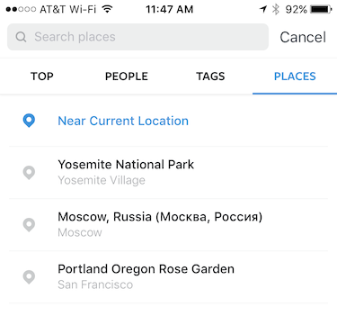

When I created Spotsy in 2013, I always knew it might get replaced with similar functionality in Instagram's own app. Spotsy is an iPhone app [Alex Sailer](https://twitter.com/alexsailer) and I created for location search on Instagram. It started out as Instanear and initially only showed photos tagged close by. After user research, we added functionality for popular locations, searching anywhere in the world, and saving your favorite spots. Recently though, Instagram added most of this same functionality to their own app. Making Spotsy irrelevent.*\**

I sort of suspected something might be up when [Instagram started changing their APIs](). Those API changes altered how Instagram populated the list of nearby locations when you tag a photo in the Instagram app. This is important because before the changes that location data was coming from another social service: Foursquare. Instead of giving all of that useful data to Foursquare, Facebook probably wanted to keep it and improve their own location data. The more information Facebook has about your physical location in the real world, the more accurate their model of you as a consumer is which most likely improves their targetted ad success rate.

Overall, I'm really happy with the new functionality in the Instagram app, here are the things I like:

* **It's integrated into the app.** You can't really get much better than that. Just keep using the Instagram app, go to the explore tab and you can search for a location, or navigate the big banner at the top that changes periodically with interesting themes.

* **Trending Places.** I like how they did this too. If you scroll through the banner at the top of the Explore tab you can see one for Trending locations. I've noticed that the first few seem to be close by locations that are trending and as you keep going down the list they get more and more universal. This is smart. If you live somewhere with not much going on, just seeing what's nearby is pretty boring. So, they show you a few things near by, and expand outward as you scroll further down the list.

* **Location and People Exploring is combined.** They seamlessly mixed together the interface for exploring people and locations. Spotsy was almost exclusively focused on location, but I think a key element of Instagram's success is discovering actual people. Artists or creatives who have work that is best displayed visually.

Ultimately, I think the purpose of this new feature is to augment Facebook's location data. Facebook released this page: [https://www.facebook.com/places](https://www.facebook.com/places) a while ago, and now that all the Instagram and Facebook location data is working together I think Facebook is going to get a lot better at mining location data. Things like finding a good place to eat or a museum your friends like will become a lot better because you'll know if your friends tagged photos there, checked in on facebook, took photos of food there, etc.

As for me, it's kind of a relief. I thought up and implemented an idea that became a feature of one of the most popular social networks. I always enjoyed working on Spotsy, but I knew it wasn't something I wanted to commit all of my time to. It was a great challenge to learn the iOS APIs, Instagram APIs, Foursquare, APIs and Objective-C. I loved getting to go deep on interaction and animation. Spotsy was always a part time side project, but I'm also transitioning out of my full time job at Zoomdata, and I'm looking for a new opportunity. I think this whole experience gave me another perspective on what I like and don't like about building and launching products. It gives me great hope for the future and I don't regret anything about the experience. If you have an idea, go for it, you never know what you'll learn.

###### * Something similar happened when I created a website called ApartmentsNearMetro.com, which got [shut down by Craigslist.]()
